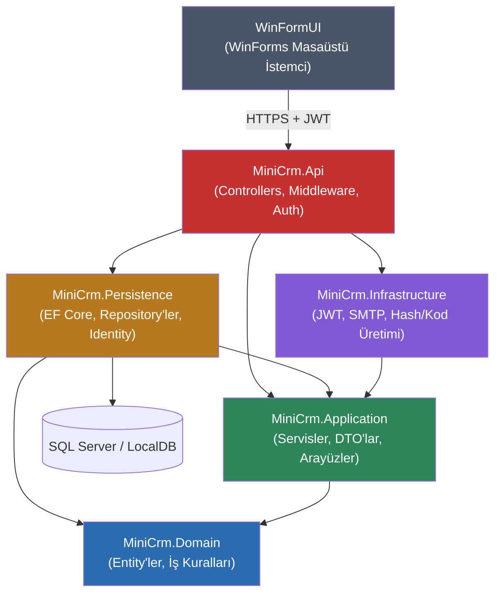
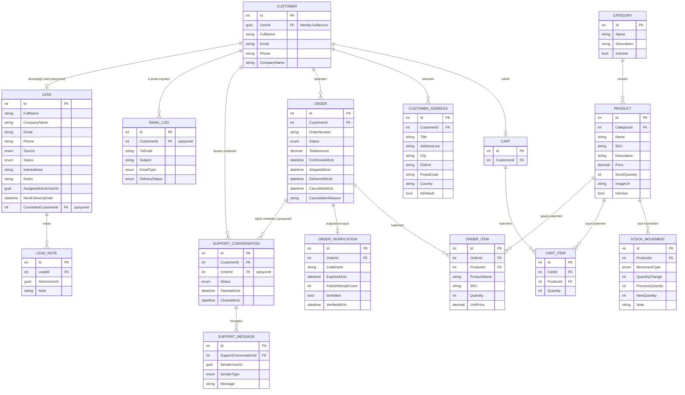
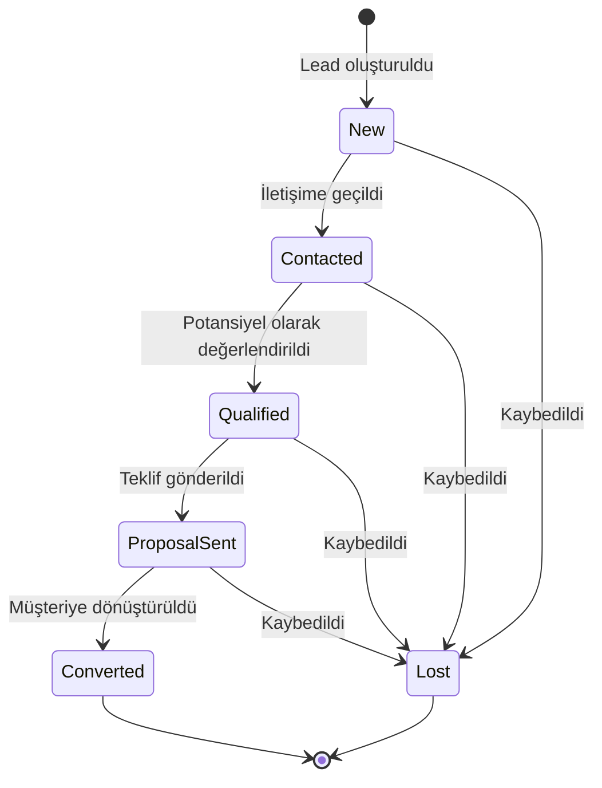
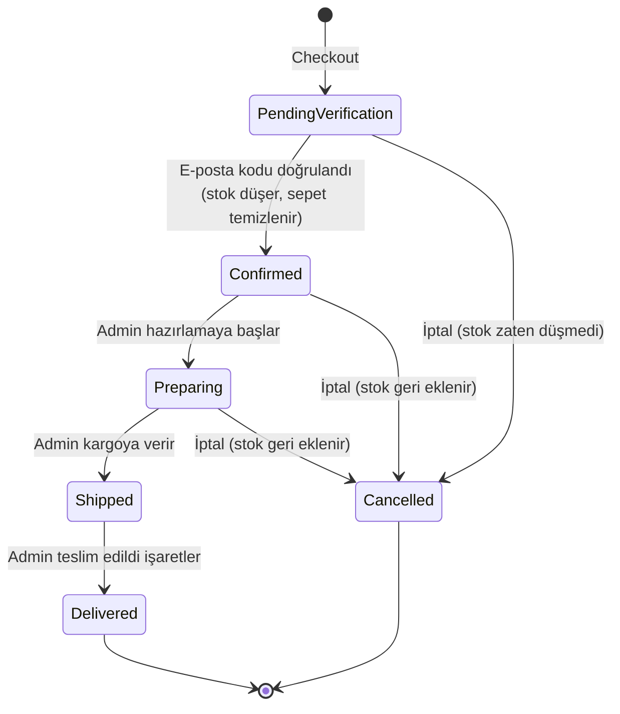
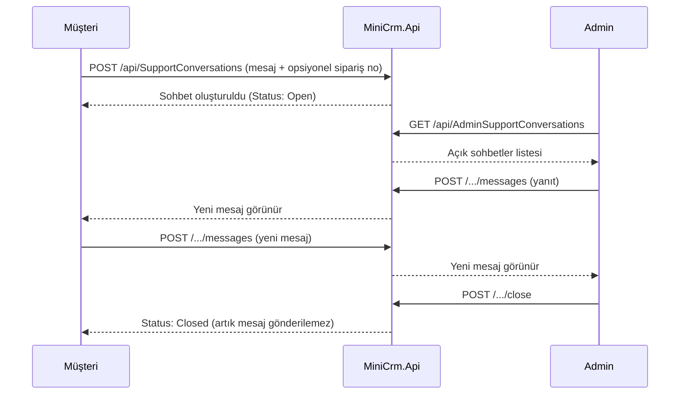

# MiniCrm

MiniCrm; potansiyel müşteri (lead) takibi, müşteri yönetimi, ürün ve stok takibi, kalıcı sepet ve adres defteri, sipariş akışı, e-posta doğrulama ve müşteri-admin destek sohbetlerini tek bir sistemde birleştiren, **katmanlı mimariyle** geliştirilmiş bir CRM/e-ticaret backend'i ve buna bağlı çalışan bir **WinForms masaüstü istemcisidir**.

Proje iki ana parçadan oluşur:

- **MiniCrm.Api** — ASP.NET Core Web API backend'i (Domain / Application / Persistence / Infrastructure / Api katmanları)
- **WinFormUI** — Admin ve Müşteri panellerini içeren .NET WinForms masaüstü istemcisi

Backend; SOLID prensipleri, Repository + Service yaklaşımı, EF Core Code First, ASP.NET Core Identity, JWT tabanlı kimlik doğrulama, rol bazlı yetkilendirme, merkezi hata yönetimi ve soft-delete gibi gerçek bir üretim uygulamasında kullanılan yaklaşımları içerecek şekilde geliştirilmiştir.

---

## İçindekiler

- [Projenin Amacı](#projenin-amacı)
- [Teknolojiler](#teknolojiler)
- [Mimari](#mimari)
- [Proje Yapısı](#proje-yapısı)
- [Veri Modeli (ER Diyagramı)](#veri-modeli-er-diyagramı)
- [Temel Özellikler](#temel-özellikler)
- [Lead Yönetimi](#lead-yönetimi)
- [Kimlik Doğrulama ve Yetkilendirme](#kimlik-doğrulama-ve-yetkilendirme)
- [Sipariş Akışı](#sipariş-akışı)
- [Destek Sohbetleri](#destek-sohbetleri)
- [WinFormUI Masaüstü İstemcisi](#winformui-masaüstü-i̇stemcisi)
- [Veritabanı ve EF Core](#veritabanı-ve-ef-core)
- [Hata Yönetimi ve Güvenlik](#hata-yönetimi-ve-güvenlik)
- [Kurulum](#kurulum)
- [User Secrets Yapılandırması](#user-secrets-yapılandırması)
- [Migration İşlemleri](#migration-i̇şlemleri)
- [Projeyi Çalıştırma](#projeyi-çalıştırma)
- [Swagger Kullanımı](#swagger-kullanımı)
- [Önemli API Grupları](#önemli-api-grupları)
- [Test Durumu](#test-durumu)
- [Planlanan Geliştirmeler](#planlanan-geliştirmeler)

---

# Projenin Amacı

MiniCrm'in amacı klasik bir CRUD uygulamasının ötesine geçen, satış öncesinden (lead) satış sonrasına (destek) kadar birbirine bağlı gerçek iş süreçlerini uçtan uca (backend + masaüstü istemci) yöneten bir CRM/e-ticaret sistemi oluşturmaktır.

Sistem içerisinde şu süreçler birbiriyle ilişkili şekilde çalışır:

- potansiyel müşteri (**lead**) kaydı, takibi ve gerçek müşteriye dönüştürülmesi,
- kullanıcı kayıt ve giriş işlemleri (JWT),
- kullanıcının kendi hesabını yönetmesi: profil bilgileri, **şifre değiştirme**, **e-posta değiştirme**,
- müşteri **adres defteri** ve bu adreslerin sipariş sırasında doğrudan seçilebilmesi,
- kategori ve ürün yönetimi (soft-delete uyumlu),
- stok takibi ve stok hareket geçmişi,
- kalıcı (veritabanı tabanlı) sepet,
- e-posta doğrulamalı sipariş oluşturma,
- sipariş durum yönetimi (hazırlama → kargo → teslim),
- müşteri-admin destek sohbetleri (isteğe bağlı sipariş bağlantılı),
- Admin ve Müşteri için ayrı WinForms masaüstü panelleri.

---

# Teknolojiler

## Backend (MiniCrm.Api ve alt katmanlar)

- **.NET 10 / C#**
- **ASP.NET Core Web API**
- **Entity Framework Core 10** (Code First)
- **SQL Server / SQL Server LocalDB**
- **ASP.NET Core Identity** (lockout, şifre politikası, şifre/e-posta değiştirme)
- **JWT Bearer Authentication** + Role-Based Authorization
- **OpenAPI / Swagger**
- **SMTP** (e-posta doğrulama ve bildirimler)
- **Repository Pattern + Service Layer + Unit of Work**
- **Global Exception Handling** (`ProblemDetails`)
- **Rate Limiting**, **Health Checks**, **Security Headers**

## Masaüstü İstemci

- **WinForms (.NET 10, Windows Desktop)**
- `HttpClient` üzerinden JWT ile API'ye bağlanan Admin ve Müşteri panelleri

---

# Mimari

Proje 6 ayrı .NET projesinden oluşan katmanlı bir mimariye sahiptir: 5 backend katmanı + 1 masaüstü istemci.

```text
MiniCrm.sln
│
├── MiniCrm.Domain           (iş kuralları, entity'ler — bağımsız)
├── MiniCrm.Application       (use-case'ler, DTO'lar, servis/repository arayüzleri)
├── MiniCrm.Persistence        (EF Core, repository implementasyonları, Identity)
├── MiniCrm.Infrastructure     (JWT, SMTP, hash/kod üretimi)
├── MiniCrm.Api                 (HTTP katmanı, controller'lar)
└── WinFormUI                   (Admin + Müşteri masaüstü istemcisi, sadece HTTP üzerinden konuşur)
```

Katmanlar arası bağımlılık yönü:



`MiniCrm.Domain` hiçbir katmana bağımlı değildir; tüm iş kuralları (entity davranışları, `DomainException`, value object'ler) burada yaşar. `WinFormUI` ise backend'e **sadece HTTP/JSON üzerinden** bağlanır — hiçbir backend projesine doğrudan referans vermez.

---

## MiniCrm.Domain

Sistemin temel iş nesnelerini ve business rule'larını içerir.

Entity'ler: `Lead`, `LeadNote`, `Customer`, `CustomerAddress`, `Category`, `Product`, `StockMovement`, `Cart`, `CartItem`, `Order`, `OrderItem`, `OrderVerification`, `SupportConversation`, `SupportMessage`, `EmailLog`.

Ayrıca: enum'lar (`LeadStatus`, `LeadSource` dahil), value object'ler (`OrderAddress`), `DomainException`, entity davranışları (ör. `Product.EnsurePurchasable`, `Order.Confirm`, `Cart.RemoveProduct`, `Lead.ConvertToCustomer`).

## MiniCrm.Application

Kullanım senaryolarını ve servis sözleşmelerini içerir: DTO'lar, Repository/Service arayüzleri, business service implementasyonları, `IUnitOfWork`, rol sabitleri.

```text
Controller → IOrderService → OrderService → IOrderRepository → Persistence
```

## MiniCrm.Persistence

Veritabanı erişim katmanı: `AppDbContext`, EF Core entity configuration'ları, repository implementasyonları, ASP.NET Core Identity entegrasyonu, migration'lar, `UnitOfWork`, `AuthService` (login, register, şifre/e-posta değiştirme), `LeadService` (lead yaşam döngüsü ve müşteriye dönüştürme), identity seeding.

## MiniCrm.Infrastructure

Dış servis ve teknik altyapı implementasyonları: JWT token üretimi, SMTP e-posta gönderimi, doğrulama kodu üretimi/hash'leme, sipariş numarası üretimi.

## MiniCrm.Api

HTTP katmanı: controller'lar, authentication/authorization middleware'i, Swagger/OpenAPI, global exception handling, rate limiting, security headers, health check, uygulama başlangıç konfigürasyonu (`Program.cs`).

## WinFormUI

Backend'e JWT ile bağlanan masaüstü istemci. İki ayrı panel sunar:

- **AdminPage** — ürün/kategori/sipariş/müşteri/destek sohbeti/**lead** yönetimi
- **CustomerPage** — ürün kataloğu, sepet, siparişler, destek sohbeti

Her iki panelde de sağ üstteki dişli butonu artık ortak bir **"Hesabım"** ekranı açar (profil, şifre/e-posta değiştirme, müşteri için adres defteri).

---

# Proje Yapısı

```text
MiniCrm
│
├── MiniCrm.Api
│   ├── Controllers            (LeadsController dahil)
│   ├── BackgroundServices        (LocalDB keep-alive vb.)
│   ├── ErrorHandling
│   ├── Middleware
│   ├── OpenApi
│   ├── Program.cs
│   └── appsettings.json
│
├── MiniCrm.Application
│   ├── Common
│   ├── DTOs                    (Leads, Auth/Change*, Addresses, Profile ...)
│   ├── Interfaces
│   │   ├── Repositories
│   │   └── Services
│   └── Services
│
├── MiniCrm.Domain
│   ├── Common
│   ├── Entities                (Lead, LeadNote dahil)
│   ├── Enums                    (LeadStatus, LeadSource dahil)
│   ├── Exceptions
│   └── ValueObjects
│
├── MiniCrm.Persistence
│   ├── Configurations
│   ├── Context
│   ├── Identity
│   ├── Migrations
│   ├── Repositories
│   ├── Seed
│   └── Services                 (AuthService, LeadService dahil)
│
├── MiniCrm.Infrastructure
│   ├── Authentication
│   ├── Email
│   ├── Orders
│   └── Security
│
├── WinFormUI
│   ├── AdminPage.cs / .Designer.cs          (Leadler sekmesi dahil)
│   ├── CustomerPage.cs / .Designer.cs
│   ├── AccountForm.cs                        (Hesabım: profil, şifre/e-posta, adres defteri)
│   ├── AddressPickerForm.cs, SavedAddressEditForm.cs
│   ├── LeadEditForm.cs, LeadDetailForm.cs
│   ├── Login.cs, KayıtOlmaForm.cs
│   ├── ProductEditForm.cs, CategoryEditForm.cs
│   ├── NewSupportRequestForm.cs
│   ├── OrderVerificationForm.cs
│   └── ApiConfig.cs                          (tek noktadan API adresi)
│
└── MiniCrm.sln
```

---

# Veri Modeli (ER Diyagramı)



Tüm entity'ler `BaseEntity`'den (`Id`, `CreatedAtUtc`, `UpdatedAtUtc`, `IsDeleted`, `DeletedAtUtc`) türer ve global soft-delete query filter'ına tabidir; yukarıdaki diyagramda okunabilirlik için bu ortak alanlar gösterilmemiştir.

> `Order.ShippingAddress` (`OrderAddress`) ayrı bir tablo değil, `Order` üzerinde EF Core "owned type" (complex property) olarak saklanan bir value object'tir; bu yüzden diyagramda ayrı bir varlık olarak gösterilmemiştir.

---

# Temel Özellikler

## Müşteri Yönetimi ve Hesap

Müşteriler sisteme kayıt olabilir, giriş yapabilir. Sağ üstteki **"Hesabım"** ekranından (hem Admin hem Customer için ortak, role göre uyarlanan tek bir form):

- profil bilgilerini (ad/telefon/şirket) görüntüleyip güncelleyebilir,
- **şifresini değiştirebilir** (mevcut şifre doğrulaması + Identity parola politikası ile),
- **e-posta adresini değiştirebilir** (mevcut şifre onayı + benzersizlik kontrolüyle; `Customer.Email` otomatik senkronize edilir),
- (yalnızca Customer) **adres defterini** yönetebilir: adres ekleyip düzenleyebilir, varsayılan adresi istediği zaman değiştirip kaldırabilir (aynı anda yalnızca bir adres varsayılan olabilir).

Şifre ve e-posta değiştirme uçları, art arda yanlış "mevcut şifre" denemelerinde login akışıyla aynı Identity lockout mekanizmasına tabidir (brute-force koruması).

## Adres Defteri ve Checkout Entegrasyonu

Müşterinin kaydettiği adresler artık sadece saklanmakla kalmıyor, **checkout akışında doğrudan kullanılıyor**: sipariş verirken açılan adres seçim ekranı kayıtlı adresleri listeler, alıcı adı/telefon bilgisi profilden ön doldurulur, hiç kayıtlı adres yoksa önce bir tane eklenmesi istenir. Tek kullanımlık/kaydedilmeyen adres girişi kaldırılmıştır — adres defteri gerçek anlamda tek doğruluk kaynağıdır.

## Kategori Yönetimi

Admin kategori oluşturabilir, güncelleyebilir, aktif/pasif yapabilir ve soft-delete uygulayabilir. **Bir kategori silindiğinde altındaki ürünler etkilenmez** — sadece kategori kendisi listeden gizlenir; ürünler admin panelinde erişilebilir kalır, sadece satın alınamaz hale gelir.

## Ürün Yönetimi

Admin ürün ekleyebilir, güncelleyebilir, aktif/pasif yapabilir, stok artırıp azaltabilir. SKU alanında soft-delete uyumlu unique index kullanılır.

**Satın alınabilirlik kuralı** (`Product.IsPurchasable`) tek bir yerde, entity üzerinde tanımlıdır: ürün soft-delete edilmemiş, aktif, stoğu > 0 ve kategorisi de silinmemiş/aktif olmalıdır. Bu kural; müşteri kataloğu, sepet ve checkout akışlarının **hepsinde aynı şekilde** uygulanır.

## Stok Yönetimi

Her stok değişikliği ürünün güncel `StockQuantity` değerini güncellemenin yanında `StockMovement` tablosunda da kayıt altına alınır (`InitialStock`, `AdminIncrease`, `AdminDecrease`, `OrderConfirmed`, `OrderCancelledRestock`, `CustomerReturn`) — böylece stok geçmişi tamamen audit edilebilir.

## Kalıcı Sepet ve Soft-Delete Senkronizasyonu

Her müşterinin veritabanında kalıcı bir sepeti vardır. Bir ürün **herhangi bir yolla** (silinme, deaktif edilme, kategorisinin silinmesi/deaktif edilmesi, stoğun tükenmesi) satın alınamaz hale geldiğinde, o ürün **aktif olarak** tüm müşterilerin sepetlerinden kaldırılır — müşteri artık erişemeyeceği bir ürünü sepetinde asla görmez.

---

# Lead Yönetimi

MiniCrm'i salt bir sipariş/destek sistemi olmaktan çıkarıp gerçek bir CRM'e dönüştüren modül. Henüz müşteri olmamış, ama olma ihtimali bulunan kişi/firmalar **lead** olarak takip edilir; bu modül tamamen admin kontrolündedir (self-servis kayıt yoktur).



## Temel Yapılar

- **Lead** — ad/soyad, firma, e-posta, telefon, `Source` (Website, PhoneCall, Email, SocialMedia, Fair, Reference, Other), `Status`, ilgi alanı, sonraki takip tarihi, dönüştüğü müşteri (varsa).
- **LeadNote** — bir lead'e eklenen notlar; yalnızca `Lead.AddNote(...)` üzerinden oluşturulabilir.
- **Otomatik durum notu:** Bir lead'in durumu değiştirildiğinde ("Yeni → İletişime Geçildi" gibi), bu geçiş **otomatik olarak** bir `LeadNote` kaydı olarak da düşer — hangi istemciden (WinForms, Swagger) yapılırsa yapılsın, durum geçmişi notlar listesinde tam ve tutarlı kalır. `Lost` durumuna geçerken girilen "neden" de aynı nota eklenir.

## Aynı E-posta Kontrolü

Bir e-posta ile `Lost`/`Converted` **dışında** aktif bir lead varsa yeni lead oluşturulamaz/güncellenemez; lead zaten bu e-postayla bir Customer'a karşılık geliyorsa da engellenir.

## Müşteriye Dönüştürme

`POST /api/Leads/{id}/convert`:

1. Lead zaten `Converted` ise reddedilir.
2. Aynı e-posta ile zaten bir `Customer` varsa, yeni hesap açılmadan lead doğrudan o müşteriye bağlanır.
3. Yoksa: yeni bir `ApplicationUser` (Customer rolünde), `Customer` ve boş `Cart` **tek bir transaction içinde** oluşturulur; rastgele bir geçici şifre üretilip **SMTP ile** lead'in e-posta adresine gönderilir (gönderim `EmailLog`'a `LeadConverted` tipiyle kaydedilir, gönderim başarısız olsa da dönüşüm iptal edilmez).
4. Lead `Converted` durumuna geçer ve `ConvertedCustomerId` ile ilişkilendirilir.

Bu noktadan sonra kişi normal `/api/Auth/login` (ve WinFormUI `CustomerPage`) ile sisteme giriş yapabilir hale gelir.

---

# Kimlik Doğrulama ve Yetkilendirme

Sistem ASP.NET Core Identity ve JWT kullanır. Roller: `Admin`, `Customer`. JWT içinde User ID, Email, Role ve JWT ID claim'leri bulunur.

```text
Token yok / geçersiz     → 401 Unauthorized
Token geçerli, yetki yok → 403 Forbidden
Kaynak bulunamadı        → 404 Not Found
Business rule ihlali     → 400 Bad Request
Concurrency çakışması    → 409 Conflict
```

## Hesap Uçları

| Uç | Açıklama |
|---|---|
| `POST /api/Auth/register` | Customer hesabı oluşturur |
| `POST /api/Auth/login` | JWT üretir |
| `POST /api/Auth/change-password` | Mevcut şifre doğrulanarak şifre değiştirilir (rol bağımsız — Admin da Customer da kullanır) |
| `POST /api/Auth/change-email` | Mevcut şifre doğrulanarak e-posta değiştirilir; benzersizlik kontrolü yapılır |

`change-password`/`change-email` uçlarında yanlış "mevcut şifre" denemeleri, login akışındaki `AccessFailedAsync`/lockout mekanizmasına aynı şekilde dahildir — art arda 5 hatalı denemeden sonra hesap geçici olarak kilitlenir (doğru şifre girilse bile).

---

# Sipariş Akışı



## Checkout

1. Müşteri, kayıtlı adres defterinden bir **teslimat adresi seçer** (yoksa önce bir tane ekler); alıcı adı/telefon profilinden ön doldurulur.
2. Sepet kontrol edilir, ürünlerin hâlâ satın alınabilir olduğu doğrulanır (`Product.EnsurePurchasable`).
3. Sipariş `PendingVerification` durumunda oluşturulur, sepet **hemen** temizlenir.
4. 6 haneli doğrulama kodu üretilir; kod düz metin olarak saklanmaz, HMAC tabanlı hash'i saklanır.
5. SMTP üzerinden kullanıcıya kod gönderilir (gönderilemese bile checkout başarısız olmaz, durum ayrıca raporlanır).

Doğrulama başarılı olduğunda stok düşürülür, ilgili `StockMovement` oluşturulur, doğrulama kaydı tamamlanır ve onay e-postası gönderilir. Doğrulama kodlarında süre sonu kontrolü ve maksimum başarısız deneme limiti (5) bulunur.

## Sipariş İptali

`PendingVerification`, `Confirmed` veya `Preparing` durumundaki bir sipariş iptal edilebilir. `Confirmed`/`Preparing` durumunda iptal edilirse, daha önce düşürülen stok otomatik olarak geri eklenir ve bir `StockMovement` (`OrderCancelledRestock`) kaydı oluşturulur.

---

# Destek Sohbetleri

Müşteri ile admin arasındaki tüm iletişim tek bir mesajlaşma kanalı üzerinden yürütülür; ayrı ticket/complaint/after-sales modülleri yoktur.



- Müşteri, sohbeti oluştururken **isteğe bağlı olarak** kendi siparişlerinden birine bağlayabilir (zorunlu değildir).
- Bir müşterinin aynı anda birden fazla açık sohbeti olabilir.
- `Closed` bir sohbete yeni mesaj gönderilemez (backend `400` ile reddeder); sohbeti yalnızca admin kapatabilir.

---

# WinFormUI Masaüstü İstemcisi

WinForms tabanlı masaüstü istemci, backend'e **yalnızca HTTP/JSON üzerinden** (JWT ile) bağlanır; hiçbir backend projesine derleme zamanı referansı yoktur. API adresi tek bir noktadan (`ApiConfig.BaseUrl`) yönetilir.

## AdminPage

- Ürün/kategori CRUD, stok ayarlama
- Sipariş listesi ve durum yönetimi (hazırla / kargola / teslim et / iptal et) — butonlar sadece geçerli durum geçişlerinde aktif olur
- Müşteri listesi ve detayı — liste (üst) / detay (alt) `SplitContainer` ile ortadan bölünür, pencere büyüyünce oran korunur
- Destek sohbetleri: listeleme, yanıtlama, kapatma
- **Leadler sekmesi:** durum/kaynak filtreleme, arama, lead ekleme/düzenleme, detay ekranından not ekleme + durum değiştirme + müşteriye dönüştürme

## CustomerPage

- Ürün kataloğu ve sepete ekleme
- Sepet yönetimi ve checkout (kayıtlı adres seçimiyle)
- E-posta doğrulama akışı (`OrderVerificationForm`)
- Sipariş geçmişi ve iptal
- Destek sekmesi: sol tarafta sohbet listesi, sağ tarafta seçili sohbetin mesajları ve yanıt kutusu — iki panel `SplitContainer` ile bölünür (asla üst üste binmez), pencere yeniden boyutlandırıldığında oran korunur

## Hesabım

Her iki panelin sağ üstündeki dişli butonu artık ortak bir `AccountForm` açar:

- Admin için: e-posta/rol görüntüleme + e-posta ve şifre değiştirme.
- Customer için: bunlara ek olarak profil düzenleme ve adres defteri yönetimi.

## Dayanıklılık ve Navigasyon

- Beklenmeyen istisnalar `Application.ThreadException` / `AppDomain.UnhandledException` ile yakalanır; uygulama çökmez, kullanıcıya mesaj kutusu gösterilir.
- `Login`, uygulamanın gerçek ana formudur (`Application.Run(new Login())`); diğer ekranlar (Kayıt Ol, Admin, Customer paneli) açılırken sadece gizlenir. Bu ekranlardan herhangi biri pencere kapatma (X) ile kapatılırsa kullanıcı otomatik olarak Login ekranına döner — hiçbir noktada görünmez şekilde arka planda çalışmaya devam eden bir "hayalet" pencere kalmaz.
- Durum değiştiren butonlar istek sürerken devre dışı bırakılır (çift tıklama koruması).

---

# Veritabanı ve EF Core

Proje **Entity Framework Core Code First** yaklaşımı kullanır. Tek `DbContext`: `AppDbContext`. ASP.NET Core Identity tabloları da aynı context üzerinden yönetilir.

## Yerel Geliştirme Ortamı

Yerelde **SQL Server LocalDB** kullanılır — ayrı bir servis olarak çalışmaz, bağlantı geldiğinde kullanıcı hesabına bağlı olarak otomatik ayağa kalkan hafif bir SQL Server örneğidir. Bağlantı dizesi `MiniCrm.Api/appsettings.json` içindeki `ConnectionStrings:DefaultConnection`'da tanımlıdır. `LocalDbKeepAliveService` (bkz. `MiniCrm.Api/BackgroundServices`) LocalDB'nin boşta kalıp kapanmasını önlemek için düzenli aralıklarla hafif bir sorgu gönderir; ayrıca uygulama başlangıcında bağlantı geçici olarak hazır değilse otomatik olarak yeniden dener.

## Audit Alanları

Tüm domain entity'leri `BaseEntity` üzerinden `Id`, `CreatedAtUtc`, `UpdatedAtUtc`, `IsDeleted`, `DeletedAtUtc` alanlarını kullanır; bu alanlar `AppDbContext.SaveChangesAsync` içinde merkezi olarak yönetilir.

## Soft Delete

Hiçbir business entity fiziksel olarak silinmez:

```text
DELETE → IsDeleted = true, DeletedAtUtc = şimdi
```

EF Core global query filter ile silinmiş kayıtlar normal sorgulardan otomatik hariç tutulur. Bir entity soft-delete edildiğinde, ona bağımlı olan ve artık geçersiz hale gelen ilişkili kayıtlar (örn. bir ürün silindiğinde onu içeren aktif sepet kalemleri) de ilgili domain metotlarıyla ayrıca temizlenir.

## Concurrency

`DbUpdateConcurrencyException`, `Unit of Work` seviyesinde bastırılmadan olduğu gibi fırlatılır ve `GlobalExceptionHandler` tarafından `409 Conflict` olarak client'a raporlanır.

---

# Hata Yönetimi ve Güvenlik

## Global Exception Handling

API merkezi `GlobalExceptionHandler` (`IExceptionHandler`) kullanır; hatalar `ProblemDetails` formatında döner:

```json
{
  "title": "Not Found",
  "status": 404,
  "detail": "Product was not found.",
  "instance": "/api/Products/999",
  "traceId": "..."
}
```

Beklenmeyen `500` hatalarında ve `DbUpdateException`/`DbUpdateConcurrencyException`'da (409) internal exception detayları client'a gönderilmez — sadece güvenli, genel bir mesaj döner; tam detay sunucu tarafında loglanır.

> Not: Visual Studio ile hata ayıklarken (F5), iş kuralı ihlallerinde (ör. yetersiz stok) fırlatılan `DomainException`'lar için debugger "kullanıcı tarafından işlenmemiş özel durum" uyarısı gösterebilir. Bu bir çökme değildir — istisna zaten `GlobalExceptionHandler` tarafından merkezi olarak yakalanıp temiz bir `400` yanıtına çevrilir; "Devam Et" ile akışa devam edilebilir, dilerse Debug → Exception Settings üzerinden bu istisna türü için durma kapatılabilir.

## Rate Limiting

Authentication endpoint'lerinde (`/api/Auth/*` — login, register, change-password, change-email dahil) IP bazlı rate limiting bulunur (brute-force koruması). Limit aşımında `429 Too Many Requests` döner.

## Security Headers

`X-Content-Type-Options`, `X-Frame-Options`, `Referrer-Policy`, `Permissions-Policy` başlıkları eklenir; production ortamında HTTPS yönlendirmesi ve HSTS kullanılır.

## Health Check

```http
GET /health  →  200 OK
```

---

# Kurulum

## Gereksinimler

- .NET 10 SDK
- SQL Server / SQL Server LocalDB
- EF Core CLI (`dotnet tool install --global dotnet-ef`)
- Git
- Visual Studio 2022+ veya Visual Studio Code

## Repoyu Klonlama

```bash
git clone https://github.com/ahmetcancavdar/MiniCrmApi.git
cd MiniCrmApi
```

## Paketleri Restore Etme ve Build

```bash
dotnet restore MiniCrm.sln
dotnet build MiniCrm.sln
```

Beklenen çıktı: `0 Uyarı, 0 Hata`.

---

# User Secrets Yapılandırması

Hassas bilgiler Git repository içerisinde **tutulmamalıdır** — `appsettings.json`'da sadece placeholder/yapısal ayarlar bulunur, gerçek değerler `dotnet user-secrets` ile ayarlanmalıdır.

```bash
cd MiniCrm.Api
dotnet user-secrets init
dotnet user-secrets set "Jwt:Key" "YOUR_LONG_RANDOM_JWT_SECRET"
dotnet user-secrets set "Verification:HashKey" "YOUR_LONG_RANDOM_VERIFICATION_HASH_KEY"
dotnet user-secrets set "Smtp:Username" "your-email@example.com"
dotnet user-secrets set "Smtp:Password" "YOUR_SMTP_APP_PASSWORD"
dotnet user-secrets set "Smtp:FromEmail" "your-email@example.com"
dotnet user-secrets set "Admin:Email" "admin@minicrm.local"
dotnet user-secrets set "Admin:Password" "YOUR_ADMIN_PASSWORD"
```

Secret listesini kontrol etmek için:

```bash
dotnet user-secrets list
```

> Gerçek JWT key, SMTP şifresi, verification hash key veya production credential değerlerini asla GitHub'a commit etmeyin.

---

# Migration İşlemleri

```bash
dotnet ef migrations list --project MiniCrm.Persistence --startup-project MiniCrm.Api

dotnet ef migrations has-pending-model-changes --project MiniCrm.Persistence --startup-project MiniCrm.Api

dotnet ef database update --project MiniCrm.Persistence --startup-project MiniCrm.Api

dotnet ef migrations add MigrationName --project MiniCrm.Persistence --startup-project MiniCrm.Api
```

---

# Projeyi Çalıştırma

## Backend

```bash
dotnet run --project MiniCrm.Api
```

Development ortamında Swagger/OpenAPI erişime açılır; terminalde gösterilen localhost adresinden erişilebilir.

## Masaüstü İstemci

Visual Studio'dan `WinFormUI` projesini başlangıç projesi olarak seçip çalıştırabilir, ya da:

```bash
dotnet run --project WinFormUI
```

> `WinFormUI`, `MiniCrm.Api`'nin çalışıyor olmasını bekler (varsayılan olarak `https://localhost:7048` adresine bağlanır, bkz. `WinFormUI/ApiConfig.cs`). En sağlıklı deneyim için ikisini birlikte (Visual Studio'da "birden fazla başlangıç projesi" ayarıyla) çalıştırın.

---

# Swagger Kullanımı

1. `POST /api/Auth/register` ile customer hesabı oluşturun.
2. `POST /api/Auth/login` ile JWT alın.
3. Swagger'daki **Authorize** butonuna JWT'yi girin.
4. Role uygun endpoint'leri çağırın.

Admin ve Customer endpoint'leri rol bazlı authorization ile birbirinden ayrılmıştır.

---

# Önemli API Grupları

| Grup | Route | Açıklama |
|---|---|---|
| Authentication | `/api/Auth` | register, login, change-password, change-email |
| Profile | `/api/Profile` | profil görüntüleme/güncelleme |
| Addresses | `/api/Addresses` | adres CRUD, varsayılan adres |
| Categories | `/api/Categories` | kategori CRUD (admin) + listeleme |
| Products | `/api/Products` | ürün CRUD, stok yönetimi, stok hareketleri |
| Cart | `/api/Cart` | kalıcı müşteri sepeti |
| Orders (Customer) | `/api/Orders` | checkout, verify, resend, list/detail, cancel |
| Orders (Admin) | `/api/AdminOrders` | prepare, ship, deliver, cancel |
| Leads (Admin) | `/api/Leads` | lead CRUD, durum değiştirme, not ekleme, müşteriye dönüştürme |
| Support (Customer) | `/api/SupportConversations` | sohbet oluşturma, mesajlaşma |
| Support (Admin) | `/api/AdminSupportConversations` | tüm sohbetler, yanıtlama, kapatma |
| Admin Customers | `/api/AdminCustomers` | müşteri listesi |

---

# Test Durumu

Sistem geliştirme sürecinde Swagger ve canlı API çağrılarıyla modül modül manuel olarak test edilmiştir. Kontrol edilen başlıca akışlar: register/login, JWT authorization, role kontrolü, category/product CRUD, stok hareketleri, cart, checkout (kayıtlı adresle), SMTP verification, order lifecycle (confirm/prepare/ship/deliver/cancel + restock), soft-delete zinciri (ürün/kategori silinince sepetten kaldırma), destek sohbeti akışı, **lead yaşam döngüsü** (oluşturma → not → durum değişimi → müşteriye dönüştürme, otomatik durum notu üretimi dahil), **şifre/e-posta değiştirme** (brute-force lockout dahil), adres defterinde varsayılan adres tekilliği, 400/401/403/404/409/429 davranışları, health check, security headers.

## Otomatik Test

Repository içerisinde henüz kapsamlı otomatik test suite'i bulunmamaktadır. Planlanan yapı:

```text
tests
├── MiniCrm.Domain.Tests
├── MiniCrm.Application.Tests
└── MiniCrm.Api.IntegrationTests
```

---

# Planlanan Geliştirmeler

- xUnit unit/integration testleri
- GitHub Actions CI
- pagination ve gelişmiş filtering/search
- refresh token, e-posta ile hesap onayı, e-posta linkiyle şifre sıfırlama (şifre/e-posta değiştirme zaten mevcut, ama "şifremi unuttum" akışı henüz yok)
- lead'ler için web sitesinden gelen public/anonim bir capture formu (`POST /api/PublicLeads` gibi)
- Redis cache
- **SignalR ile gerçek zamanlı destek mesajlaşması ve sipariş/lead bildirimleri**
- Docker / Docker Compose / CI-CD
- production deployment (gerçek SQL Server / Azure SQL)

---

# Sonuç

MiniCrm; yalnızca müşteri CRUD işlemleri yapan basit bir CRM örneği değil, satış öncesi lead takibinden satış sonrası desteğe kadar birbiriyle ilişkili iş akışlarını uçtan uca (backend + masaüstü istemci) yöneten katmanlı bir sistemdir. Kapsamında lead yönetimi, authentication/authorization (şifre/e-posta değiştirme dahil), müşteri yönetimi, adres defteri, ürün/stok, sepet, sipariş, e-posta doğrulama, destek sohbeti, audit/soft-delete, merkezi exception handling ve rate limiting gibi backend geliştirmede kullanılan temel konseptler; WinForms masaüstü istemcisiyle birlikte tek bir çalışan sistem içerisinde uygulanmıştır.
